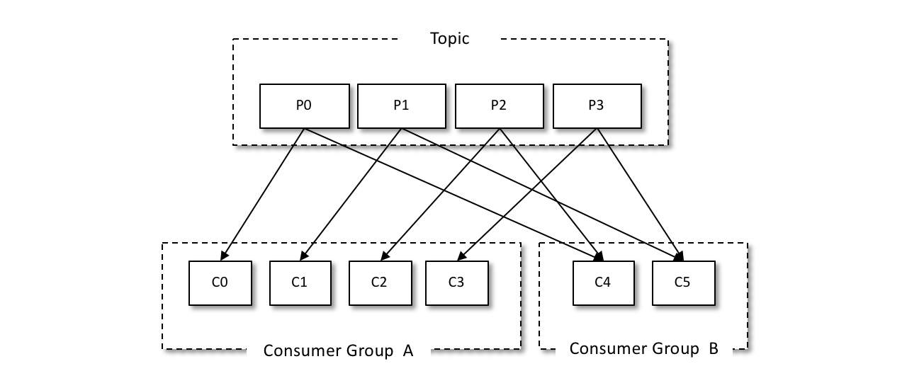
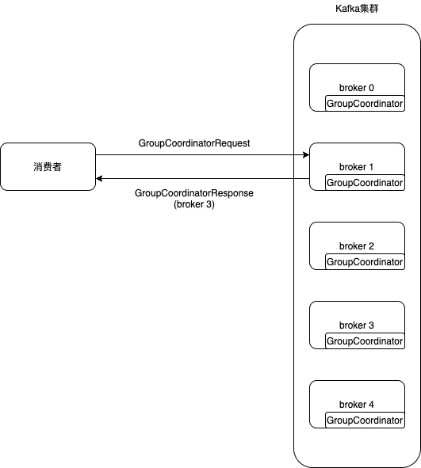
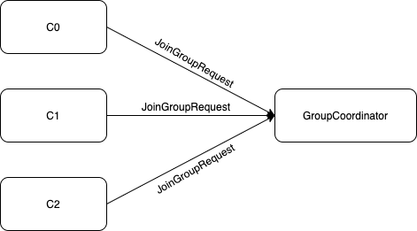
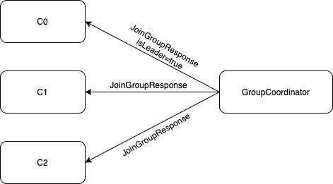
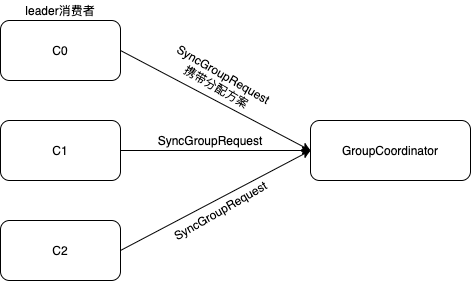

# 1. 前言

在Kafka中，当主题的分区数增加、或有新的消费者加入和订阅主题时，就会触发消费组的再均衡（Rebalance）机制，将消费组中各消费者对于主题分区的所有权进行重新的分配。本文主要介绍了再均衡的具体原理，以及结合源码进行深入学习。

## 1.1 什么是再均衡

一个Kafka集群的体系架构如下图所示，Kafka集群由一至多个broker组成，它们通过ZooKeeper来管理元数据，生产者将消息发送到Kafka集群，而消费者又从Kafka集群中拉取消息。


在Kafka中，消息被发到特定的主题，而一个主题又可以配置为多个分区，因此发往这个主题的消息就会被分配到多个分区上了。

而在一个消费组中，当有多个消费者订阅了这个主题，主题的这些分区就会分别被分配给这些消费者，每个消费者只能拉取被分配到的分区的消息。通过水平扩展多个消费者，可以极大地提升消息的消费效率。

如下图所示，一个主题分成4个分区P0、P1、P2、P3，有两个消费组A和B，它们分别给自己的消费组分配对应的分区，不同的消费者分别对应负责不同的分区。消费组A的四个消费者正好分别分配到一个分区，四个消费者各自拉取分配给自己的分区进行消息消费，而消费组B的两个消费者则分别分配了两个分区。



看起来一切都很稳定，消费组里每个消费者各司其职，都有它们负责的分区。可是实际上分区的分配往往会发生变化，主题的分区数增加，以及消费组的消费者数量增加减少，都会对现有的分区分配造成影响。这时候，就需要重新给消费组的消费者们分配分区，这个过程就叫做消费组的分区再均衡（Rebalance）。

## 1.2 再均衡触发条件

既然再均衡是把分区分配给消费者这个结果的再次分配，因此触发再均衡的条件大体上可以分为分区数量变化和消费者数量变化。实际上有以下几种情况：

- 主题的分区数量的变化，由于主题的分区数不能减少，所以这里的变化也就指的是增加
- 有新的消费者加入消费组
- 有消费者宕机下线，或遇到长时间的GC或网络延迟等，导致消费者长时间未向GroupCoordinator发送心跳
- 有消费者主动退出消费组
- 消费者调用unsubscribe()取消对某主题的订阅


# 2. 再均衡的三种方案

Kafka历史上有过三个版本的再均衡方案，一步步改进变化成为方案三，也就是现在的方案。

## 2.1 方案一

Kafka最早的解决方案是通过ZooKeeper的watcher实现的。

每个消费组在ZooKeeper下维护了路径/consumers/[group_id]/ids，消费组的每个消费者在创建的时候，在这个ZooKeeper路径下用临时节点记录自己的消费者id属于此消费组。每个消费者分别在/consumers/[group_id]/ids和/brokers/ids路径上注册一个watcher，以分别监听消费组的消费者变化和broker增减变化。当/consumers/[group_id]/ids路径的子节点发生变化时，表示消费组中的消费者出现了变化，当/brokers/ids路径的子节点发生变化时，表示broker出现了增减。


每个消费者通过watcher监控消费组和Kafka集群的状态，这种方案严重依赖于ZooKeeper，会有两个比较严重的问题：

- 羊群效应（Herd Effect）：一个被监听的ZooKeeper节点变化，会导致大量的watcher通知被发送给客户端，从而导致在通知期间的其他操作延迟。
- 脑裂（Split Brain）：每个消费者通过ZooKeeper来保存元数据和再均衡结果，不同消费者在同一时刻可能连接到ZooKeeper集群的不同服务器，看到的数据就可能不一样。

## 2.2 方案二

将全部消费组分成多个子集，每个消费组的子集在Kafka集群服务端对应一个broker中的GroupCoordinator进行管理，GroupCoordinator是Kafka服务端中一个用于管理消费组的组件。

消费者不再依赖ZooKeeper，而只有GroupCoordinator会在ZooKeeper上添加watcher。消费者在加入或退出消费组时会修改ZooKeeper的元数据，触发GroupCoordinator的watcher，通知GroupCoordinator就开始再均衡操作。


此方案中，分区的分配操作是在服务端的GroupCoordinator中完成的。

此方案的优点是，解决了羊群效应和脑裂问题。但此方案也有缺点，因为分区的分配操作是由GroupCoordinator完成的，因此分区分配策略在服务端之中实现，要实现新的分区分配策略时，就要修改服务端代码或配置，然后重启服务，比较麻烦。另外，自定义分区分配策略和验证需求也会很麻烦。

## 2.3 方案三

自Kafka 0.9版本又进行了重新设计，将分区分配的工作放到了消费者端进行处理，而消费组的管理工作依然由GroupCoordinator处理。这就让不同的模块关注不同的业务，实现了业务的切分和解耦。接下来主要是介绍方案三的具体细节和实现。


# 3. 再均衡的原理细节

再均衡分为消费者和服务端两块，消费者主要是负责施行分区分配策略和向服务端的GroupCoordinator发送请求，而服务端的GroupCoordinator则负责为每个消费组维护一个状态机。

## 3.1 消费者

对于消费者来说，再均衡主要分为四个阶段。

在第一阶段，消费者向Kafka集群某节点发送请求，查找消费组的GroupCoordinator。接着第二阶段是消费者向GroupCoordinator发送请求加入消费组，其中leader消费者根据分区分配策略实施分区。第三阶段将结果同步给消费组的其他各个消费者。最后到达第四阶段，消费组的各个消费者正常工作，并向GroupCoordinator发送心跳。

### 第一阶段（FIND_COORDINATOR）

再均衡操作的第一阶段是查找GroupCoordinator，这时来了一个新加入的消费者，它会向Kafka集群中的任意一个broker发送GroupCoordinatorRequest请求。而收到请求的broker会根据需要加入的消费组的groupId，返回该消费组对应的GroupCoordinator的具体信息，包括node_id、host和port。

如果消费者已经保存了与消费组对应的GroupCoordinator节点的信息，并且之前与它之间的网络连接是正确的，那么就不需要发送请求，可以直接进入第二阶段。

那么Kafka是怎么决定每个消费组归属于Kafka集群中的哪个borker管理的呢？将每个消费组的groupId计算哈希值，算出其属于主题__consumer_offsets的分区编号，再寻找此分区leader副本所在的broker节点，这个broker节点就是消费组对应的GroupCoordinator节点。

如下图为例，消费者向随机一个broker 1发送GroupCoordinatorRequest请求，broker 1返回GroupCoordinatorResponse，消息中包含了broker 3，也就是说该节点包含了消费组属于的GroupCoordinator。



发送GroupCoordinatorRequest请求的入口是ConsumerCoordinator的GroupCoordinatorRequest()方法。代码如下：

```java
protected synchronized boolean ensureCoordinatorReady(final Timer timer) {
    // 检查coordinator是否为空，以及与GroupCoordinator的连接是否正常
    if (!coordinatorUnknown())
        return true;

    do {
        if (fatalFindCoordinatorException != null) {
            final RuntimeException fatalException = fatalFindCoordinatorException;
            fatalFindCoordinatorException = null;
            throw fatalException;
        }
        // 查找集群负载最低的Node节点，并调用sendFindCoordinatorRequest创建GroupCoordinatorRequest请求
        final RequestFuture<Void> future = lookupCoordinator();
        // 调用ConsumerNetworkClient.poll()方法，发送GroupCoordinatorRequest请求并阻塞
        client.poll(future, timer);

        if (!future.isDone()) {
            // ran out of time
            break;
        }

        RuntimeException fatalException = null;

        // 检查RequestFuture对象的状态
        if (future.failed()) {
            // 如果可重试，阻塞更新metadata，否则抛出异常报错
            if (future.isRetriable()) {
                log.debug("Coordinator discovery failed, refreshing metadata", future.exception());
                client.awaitMetadataUpdate(timer);
            } else {
                fatalException = future.exception();
                log.info("FindCoordinator request hit fatal exception", fatalException);
            }
        } else if (coordinator != null && client.isUnavailable(coordinator)) {
            // 成功找到GroupCoordinator节点，但是网络连接失败，睡眠一段时间再重
            markCoordinatorUnknown("coordinator unavailable");
            timer.sleep(rebalanceConfig.retryBackoffMs);
        }

        clearFindCoordinatorFuture();
        if (fatalException != null)
            throw fatalException;
    } while (coordinatorUnknown() && timer.notExpired());

    // 返回coordinator是否非空
    return !coordinatorUnknown();
}
```

处理GroupCoordinatorResponse的入口是FindCoordinatorResponseHandler的onSuccess()方法。代码如下：

```java
public void onSuccess(ClientResponse resp, RequestFuture<Void> future) {
    log.debug("Received FindCoordinator response {}", resp);

    // 解析GroupCoordinatorResponse，得到服务端GroupCoordinator信息
    List<Coordinator> coordinators = ((FindCoordinatorResponse) resp.responseBody()).coordinators();
    if (coordinators.size() != 1) {
        // 对应的coordinators应该恰好为1个，否则抛出异常
        log.error("Group coordinator lookup failed: Invalid response containing more than a single coordinator");
        future.raise(new IllegalStateException("Group coordinator lookup failed: Invalid response containing more than a single coordinator"));
    }
    Coordinator coordinatorData = coordinators.get(0);
    Errors error = Errors.forCode(coordinatorData.errorCode());
    if (error == Errors.NONE) {
        synchronized (AbstractCoordinator.this) {
            int coordinatorConnectionId = Integer.MAX_VALUE - coordinatorData.nodeId();

            // 获取host、port，构建Node对象并赋值给coordinator
            AbstractCoordinator.this.coordinator = new Node(
                    coordinatorConnectionId,
                    coordinatorData.host(),
                    coordinatorData.port());
            log.info("Discovered group coordinator {}", coordinator);
            // 尝试与GroupCoordinator进行连接
            client.tryConnect(coordinator);
            // 启动heartbeat定时任务
            heartbeat.resetSessionTimeout();
        }
        future.complete(null);
    } else if (error == Errors.GROUP_AUTHORIZATION_FAILED) {
        future.raise(GroupAuthorizationException.forGroupId(rebalanceConfig.groupId));
    } else {
        log.debug("Group coordinator lookup failed: {}", coordinatorData.errorMessage());
        future.raise(error);
    }
}
```

### 第二阶段（JOIN_GROUP）

通过第一阶段找到消费组所对应的GroupCoordinator后，消费者向指定的GroupCoordinator发送JoinGroupRequest请求，阻塞等待Kafka服务端的响应，GroupCoordinator处理返回响应后，消费者对该响应进行处理。

GroupCoordinator会对消费组随机选出一个leader，并且根据每个消费者设置的分区分配策略，进行统计票选，将票数最多的策略作为当前消费组的分区分配策略。

如下图，首先消费者会分别向GroupCoordinator发送JoinGroupRequest请求。



发送JoinGroupRequest请求的入口是ConsumerCoordinator的joinGroupIfNeeded()方法。代码如下：

```java
boolean joinGroupIfNeeded(final Timer timer) {
    while (rejoinNeededOrPending()) {
        // 检查第一阶段返回的GroupCoordinator的状态
        if (!ensureCoordinatorReady(timer)) {
            return false;
        }

        // 设置一个needsJoinPrepare，以防止上一次再均衡还在进行时，这次再次调用onJoinPrepare
        if (needsJoinPrepare) {
            needsJoinPrepare = false;
            // 发送JoinGroupRequest请求之前的准备
            onJoinPrepare(generation.generationId, generation.memberId);
        }

        // 创建JoinGroupRequest请求，放入unsent缓存等待发送
        final RequestFuture<ByteBuffer> future = initiateJoinGroup();
        // 调用poll()方法发送JoinGroupRequest请求，阻塞等待，直到收到JoinGroupResponse或异常
        client.poll(future, timer);
        if (!future.isDone()) {
            // we ran out of time
            return false;
        }

        if (future.succeeded()) {
            // 请求正常
            Generation generationSnapshot;
            MemberState stateSnapshot;

            synchronized (AbstractCoordinator.this) {
                generationSnapshot = this.generation;
                stateSnapshot = this.state;
            }

            if (!generationSnapshot.equals(Generation.NO_GENERATION) && stateSnapshot == MemberState.STABLE) {
                ByteBuffer memberAssignment = future.value().duplicate();

                onJoinComplete(generationSnapshot.generationId, generationSnapshot.memberId, generationSnapshot.protocolName, memberAssignment);

                resetJoinGroupFuture();
                needsJoinPrepare = true;
            } else {
                final String reason = String.format("rebalance failed since the generation/state was " +
                        "modified by heartbeat thread to %s/%s before the rebalance callback triggered",
                        generationSnapshot, stateSnapshot);

                resetStateAndRejoin(reason);
                resetJoinGroupFuture();
            }
        } else {
            // 异常处理
            final RuntimeException exception = future.exception();

            resetJoinGroupFuture();

            if (exception instanceof UnknownMemberIdException ||
                exception instanceof IllegalGenerationException ||
                exception instanceof RebalanceInProgressException ||
                exception instanceof MemberIdRequiredException)
                continue;
            else if (!future.isRetriable())
                throw exception;

            resetStateAndRejoin(String.format("rebalance failed with retriable error %s", exception));
            // 睡眠一段时间重试
            timer.sleep(rebalanceConfig.retryBackoffMs);
        }
    }
    return true;
}
```

接着，GroupCoordinator向各个消费者返回JoinGroupResponse。其中对选出的一个leader消费者返回的members包含有效数据，即各个成员的信息，对其他普通消费者返回的members为空。



处理JoinGroupResponse的入口是JoinGroupResponseHandler的handle()方法。代码如下：

```java
public void handle(JoinGroupResponse joinResponse, RequestFuture<ByteBuffer> future) {
    Errors error = joinResponse.error();
    if (error == Errors.NONE) {
        if (isProtocolTypeInconsistent(joinResponse.data().protocolType())) {
            log.error("JoinGroup failed: Inconsistent Protocol Type, received {} but expected {}",
                joinResponse.data().protocolType(), protocolType());
            future.raise(Errors.INCONSISTENT_GROUP_PROTOCOL);
        } else {
            log.debug("Received successful JoinGroup response: {}", joinResponse);
            sensors.joinSensor.record(response.requestLatencyMs());

            synchronized (AbstractCoordinator.this) {
                if (state != MemberState.PREPARING_REBALANCE) {
                    future.raise(new UnjoinedGroupException());
                } else {
                    state = MemberState.COMPLETING_REBALANCE;

                    if (heartbeatThread != null)
                        heartbeatThread.enable();

                    // 解析JoinGroupResponse的generationId、memberId、protocolName信息
                    AbstractCoordinator.this.generation = new Generation(
                        joinResponse.data().generationId(),
                        joinResponse.data().memberId(), joinResponse.data().protocolName());

                    log.info("Successfully joined group with generation {}", AbstractCoordinator.this.generation);

                    // 是否为leader消费者
                    if (joinResponse.isLeader()) {
                        // leader消费者处理逻辑
                        onJoinLeader(joinResponse).chain(future);
                    } else {
                        // 普通消费者处理逻辑
                        onJoinFollower().chain(future);
                    }
                }
            }
        }
    } else {
        // 以下为各种异常的异常处理
        log.error("JoinGroup failed due to unexpected error: {}", error.message());
        future.raise(new KafkaException("Unexpected error in join group response: " + error.message()));
    }
}
```

其中的leader消费者要根据分区分配策略，对消费者进行分区，并发送SyncGroupRequest请求，入口是JoinGroupResponseHandler的onJoinLeader()方法。代码如下：

```java
private RequestFuture<ByteBuffer> onJoinLeader(JoinGroupResponse joinResponse) {
    try {
        // 进行分区操作
        Map<String, ByteBuffer> groupAssignment = performAssignment(joinResponse.data().leader(), joinResponse.data().protocolName(),
                joinResponse.data().members());

        List<SyncGroupRequestData.SyncGroupRequestAssignment> groupAssignmentList = new ArrayList<>();
        for (Map.Entry<String, ByteBuffer> assignment : groupAssignment.entrySet()) {
            groupAssignmentList.add(new SyncGroupRequestData.SyncGroupRequestAssignment()
                    .setMemberId(assignment.getKey())
                    .setAssignment(Utils.toArray(assignment.getValue()))
            );
        }

        // 创建SyncGroupRequest对象
        SyncGroupRequest.Builder requestBuilder =
                new SyncGroupRequest.Builder(
                        new SyncGroupRequestData()
                                .setGroupId(rebalanceConfig.groupId)
                                .setMemberId(generation.memberId)
                                .setProtocolType(protocolType())
                                .setProtocolName(generation.protocolName)
                                .setGroupInstanceId(this.rebalanceConfig.groupInstanceId.orElse(null))
                                .setGenerationId(generation.generationId)
                                .setAssignments(groupAssignmentList)
                );
        log.debug("Sending leader SyncGroup to coordinator {} at generation {}: {}", this.coordinator, this.generation, requestBuilder);
        // 发送SyncGroupRequest请求
        return sendSyncGroupRequest(requestBuilder);
    } catch (RuntimeException e) {
        return RequestFuture.failure(e);
    }
}

protected Map<String, ByteBuffer> performAssignment(String leaderId,
                                                    String assignmentStrategy,
                                                    List<JoinGroupResponseData.JoinGroupResponseMember> allSubscriptions) {
    // 查找分区分配策略
    ConsumerPartitionAssignor assignor = lookupAssignor(assignmentStrategy);
    if (assignor == null)
        throw new IllegalStateException("Coordinator selected invalid assignment protocol: " + assignmentStrategy);

    Set<String> allSubscribedTopics = new HashSet<>();
    Map<String, Subscription> subscriptions = new HashMap<>();

    // collect all the owned partitions
    Map<String, List<TopicPartition>> ownedPartitions = new HashMap<>();

    for (JoinGroupResponseData.JoinGroupResponseMember memberSubscription : allSubscriptions) {
        Subscription subscription = ConsumerProtocol.deserializeSubscription(ByteBuffer.wrap(memberSubscription.metadata()));
        subscription.setGroupInstanceId(Optional.ofNullable(memberSubscription.groupInstanceId()));
        subscriptions.put(memberSubscription.memberId(), subscription);
        allSubscribedTopics.addAll(subscription.topics());
        ownedPartitions.put(memberSubscription.memberId(), subscription.ownedPartitions());
    }

    // leader消费者要关注消费组中所有消费者订阅的主题
    updateGroupSubscription(allSubscribedTopics);

    isLeader = true;

    log.debug("Performing assignment using strategy {} with subscriptions {}", assignor.name(), subscriptions);

    // 进行分区分配
    Map<String, Assignment> assignments = assignor.assign(metadata.fetch(), new GroupSubscription(subscriptions)).groupAssignment();

    // 将分区结果序列化，保存到groupAssignment
    Map<String, ByteBuffer> groupAssignment = new HashMap<>();
    for (Map.Entry<String, Assignment> assignmentEntry : assignments.entrySet()) {
        ByteBuffer buffer = ConsumerProtocol.serializeAssignment(assignmentEntry.getValue());
        groupAssignment.put(assignmentEntry.getKey(), buffer);
    }

    return groupAssignment;
}
```

而普通消费者的逻辑则简单的多，只是简单地发送SyncGroupRequest请求，入口是ConsumerCoordinator的onJoinFollower()方法。代码如下：

```java
private RequestFuture<ByteBuffer> onJoinFollower() {
    // 创建SyncGroupRequest对象，assignment为空
    SyncGroupRequest.Builder requestBuilder =
        new SyncGroupRequest.Builder(
        new SyncGroupRequestData()
        .setGroupId(rebalanceConfig.groupId)
        .setMemberId(generation.memberId)
        .setProtocolType(protocolType())
        .setProtocolName(generation.protocolName)
        .setGroupInstanceId(this.rebalanceConfig.groupInstanceId.orElse(null))
        .setGenerationId(generation.generationId)
        .setAssignments(Collections.emptyList())
    );
    log.debug("Sending follower SyncGroup to coordinator {} at generation {}: {}", this.coordinator, this.generation, requestBuilder);
    // 发送SyncGroupRequest请求
    return sendSyncGroupRequest(requestBuilder);
}
```

### 第三阶段（SYNC_GROUP）

在第二阶段，leader消费者根据分区分配策略对分区进行了分配。而第三阶段则是由各个消费者向GroupCoordinator发送SyncGroupRequest请求，其中leader消费者发送的请求带有分区分配的方案。GroupCoordinator充当中间人的角色，负责转发同步分配方案。

在第二阶段中，GroupCoordinator向C0消费者返回的信息中isLeader=true，因此C0是消费组中的leader消费者。各个消费者向GroupCoordinator发送SyncGroupRequest请求，其中leader消费者的请求携带分区分配方案，以通知其他消费者，而其他消费者的请求是为了获得分区分配结果。



发送SyncGroupRequest请求的入口是ConsumerCoordinator的sendSyncGroupRequest()方法。代码如下：

```java
private RequestFuture<ByteBuffer> sendSyncGroupRequest(SyncGroupRequest.Builder requestBuilder) {
    if (coordinatorUnknown())
        return RequestFuture.coordinatorNotAvailable();
    // 发送sendSyncGroupRequest请求，其中leader消费者带有分区分配方案
    return client.send(coordinator, requestBuilder)
        .compose(new SyncGroupResponseHandler(generation));
}
```

GroupCoordinator收到SyncGroupRequest请求后，会将leader消费者发送的分配方案提取出来，连同整个消费组的元数据信息存入__consumer_offsets主题中，最后发送SyncGroupResponse响应给各个消费者，告知他们各自所属的分配方案，也就是每个消费者负责消费的分区。

消费者处理SyncGroupResponse响应的入口是ConsumerCoordinator的onJoinComplete()方法。代码如下：

```java
protected void onJoinComplete(int generation,
                              String memberId,
                              String assignmentStrategy,
                              ByteBuffer assignmentBuffer) {
    log.debug("Executing onJoinComplete with generation {} and memberId {}", generation, memberId);

    // Only the leader is responsible for monitoring for metadata changes (i.e. partition changes)
    if (!isLeader)
        assignmentSnapshot = null;

    // 查找使用的分配策略
    ConsumerPartitionAssignor assignor = lookupAssignor(assignmentStrategy);
    if (assignor == null)
        throw new IllegalStateException("Coordinator selected invalid assignment protocol: " + assignmentStrategy);

    // Give the assignor a chance to update internal state based on the received assignment
    groupMetadata = new ConsumerGroupMetadata(rebalanceConfig.groupId, generation, memberId, rebalanceConfig.groupInstanceId);

    Set<TopicPartition> ownedPartitions = new HashSet<>(subscriptions.assignedPartitions());

    // 将分区分配结果反序列化，更新assignment
    Assignment assignment = ConsumerProtocol.deserializeAssignment(assignmentBuffer);

    Set<TopicPartition> assignedPartitions = new HashSet<>(assignment.partitions());

    // 检查分区分配和订阅是否匹配
    if (!subscriptions.checkAssignmentMatchedSubscription(assignedPartitions)) {
        final String reason = String.format("received assignment %s does not match the current subscription %s; " +
                "it is likely that the subscription has changed since we joined the group, will re-join with current subscription",
                assignment.partitions(), subscriptions.prettyString());
        requestRejoin(reason);

        return;
    }

    final AtomicReference<Exception> firstException = new AtomicReference<>(null);
    Set<TopicPartition> addedPartitions = new HashSet<>(assignedPartitions);
    addedPartitions.removeAll(ownedPartitions);

    maybeUpdateJoinedSubscription(assignedPartitions);

    // 执行分区策略的onAssignment()回调函数
    firstException.compareAndSet(null, invokeOnAssignment(assignor, assignment));

    // 如果设置了自动提交，重新启动AutoCommit定时任务
    if (autoCommitEnabled)
        this.nextAutoCommitTimer.updateAndReset(autoCommitIntervalMs);

    // 将分配分区设置至assignment
    subscriptions.assignFromSubscribed(assignedPartitions);

    // 对新分配的分区添加监听器
    firstException.compareAndSet(null, invokePartitionsAssigned(addedPartitions));

    if (firstException.get() != null) {
        if (firstException.get() instanceof KafkaException) {
            throw (KafkaException) firstException.get();
        } else {
            throw new KafkaException("User rebalance callback throws an error", firstException.get());
        }
    }
}
```

### 第四阶段（HEARTBEAT）

进入这个阶段之后，消费组中的所有消费者就会处于正常工作状态。

消费者通过向GroupCoordinator发送心跳来位置它们与消费组的从属关系，以及对分区的所有权。如果消费者停止发送心跳的时间足够长，整个会话就会被判定为国旗，GroupCoordinator会认为这个消费者已经死亡，就会重新触发一次再均衡行为。如果消费者主动调用unsubscribe()方法取消对某些主题的订阅，也会触发再均衡行为。

消费者心跳间隔时间由参数heartbeat.interval.ms指定，默认值为3000，即3秒。

## 3.2 GroupCoordinator

在Kafka集群的每个broker上都会实例化一个GroupCoordinator对象，Kafka按照消费组的名字将其分配给对应的GroupCoordinator进行管理，每个GroupCoordinator负责管理所有消费组的一个子集。

GroupCoordinator主要有以下几个作用：

1. 完成消费组的分区分配工作，接受JoinGroupRequest和SyncGroupRequest请求并处理
2. 维护消费者的offset信息，将其存在Kafka内部主题__consumer_offsets中，即使消费者宕机也可以找回之前提交的offset
3. 记录消费组的相关信息，即使broker宕机导致消费组由新的GroupCoordinator进行管理，新的GroupCoordinator也可以知道消费组中每个消费者所负责处理的分区信息
4. 通过心跳检测每个消费者的状态


# 4. 分区分配策略

最后来聊聊分区分配的策略。


# 参考

- [《Apache Kafka源码剖析》](https://book.douban.com/subject/27038473/)
- [《深入理解Kafka：核心设计与实践原理》](https://book.douban.com/subject/30437872/)

