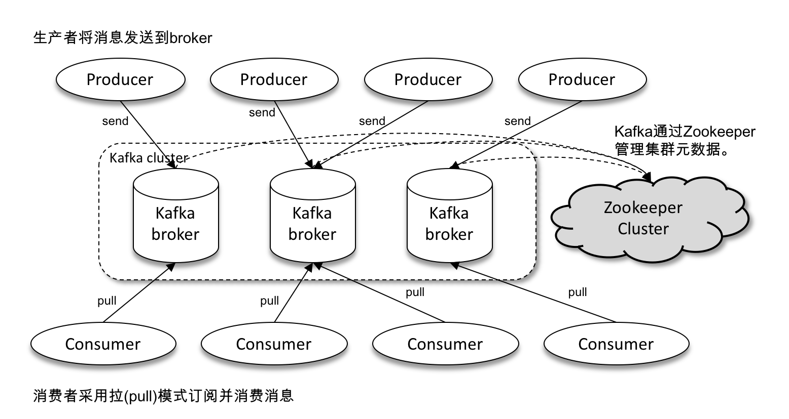
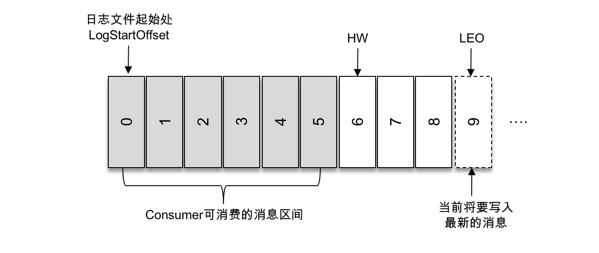
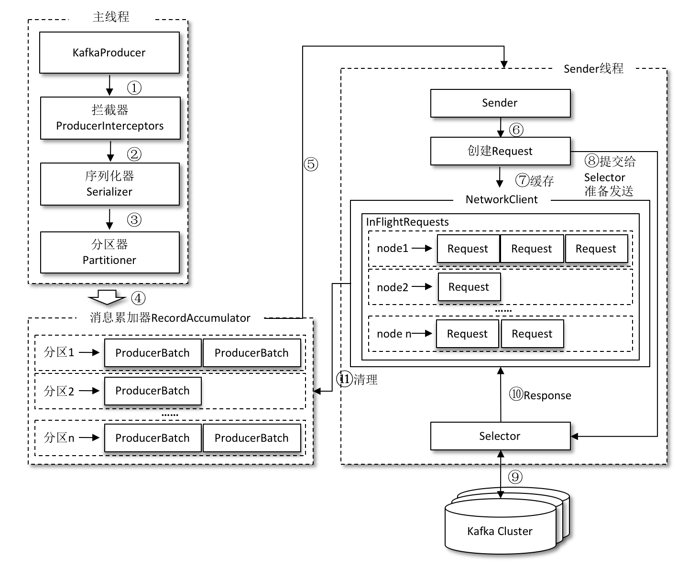
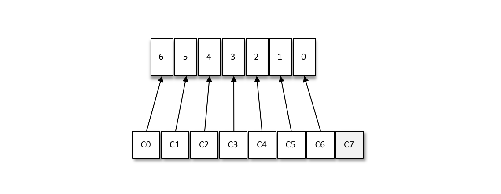

# 1. 介绍

Kafka是LinkedIn采用Scala开发的一个多分区、多副本、基于ZooKeeper协调的分布式消息系统，已被捐献给Apache基金会。Kafka定位为一个分布式流式处理平台，包含高吞吐、可持久化、可水平扩展、支持流数据处理等特性。Kafka有三大角色：

- 消息系统：Kafka具备系统解耦、冗余存储、流量削峰、缓冲、异步通信、扩展性、可恢复性等功能。
- 存储系统：Kafka把消息持久化到磁盘，并且有多副本机制，相比内存存储的系统降低了数据丢失的风险。
- 流式处理平台：Kafka为流式处理框架提供了可靠的数据来源。


# 2. 基本概念

## 2.1 体系架构



上图为Kafka的体系架构。一个Kafka体系架构包含若干Producer、若干Broker、若干Consumer，以及一个ZooKeeper集群。

- ZooKeeper：负责集群元数据的管理、控制器的选举。
- 生产者Producer：将消息发送到Broker。
- 消费者Consumer：从Broker订阅主题并消费消息。
- 服务代理节点Broker：将收到的消息存储到磁盘。Broker可以看作一个Kafka服务节点或Kafka服务实例，可以将多个Broker运行在不同的服务器上，也可以运行在同一个服务器但是配置不同的端口。

## 2.2 主题与分区

#### 主题Topic

Kafka的消息以主题进行归类，这是一个逻辑上的概念。生产者将消息发送到特定主题，而消费则订阅主题并进行消费。

#### 分区Partition

一个主题可以分为多个分区，而一个分区只属于某个主题。同一个主题下，不同分区包含的消息是不同的，分区在存储层面可以看做一个可追加的日志文件，消息追加到分区日志文件后会分配一个特定的偏移量offset。offset是消息在分区的唯一标识，offset可以保证消息在分区内的顺序性，每个分区有分别的offset，因此Kafka保证的是分区有序而不是主题有序。

一个主题的各个分区可以分布在不同的broker上，每条消息被发送到broker前，会根据分区规则选择存储到哪个具体的分区。因此在创建主题的时候通过参数指定分区的个数，或者创建完成后修改分区数量，以实现分区水平扩展，突破机器IO的性能瓶颈。

目前Kafka只支持增加分区数，不支持减少分支数。

#### 副本Replica

分区的多副本机制可以增加副本数量以提升容灾能力，统一分区的不同副本保存相同的消息，副本之间为一主多从的关系，其中leader副本负责处理读写请求，follower副本只负责与leader副本的消息同步。副本处于不同的broker重，当leader副本出现故障时，便从follower副本重新选举新的leader副本对外提供服务。

下图展示了在一个有4个broker的集群中，一个主题配置了3个分区P1、P2、P3。副本因子为3，即每个分区包含有3个副本，一个是leader副本两个是follower副本，这3个副本存储在不同的broker中。


分区的所有副本统称为AR（Assigned Replicas），leader副本以及与leader副本保持一定程度同步的副本组成ISR（In-Sync Replicas），与leader副本同步滞后过多的副本组成OSR（Out-of-Sync Replicas），因此AR=ISR+OSR。leader副本维护和跟踪ISR集合与自己的滞后状态，滞后太多或失效的副本会被从ISR剔除，变为失效副本，OSR中的副本追上leader副本则会被转移至ISR。默认配置下，leader副本发生故障后只会在ISR集合中选举新leader。

#### 偏移量offset

偏移量指消息在日志文件中的相对位置，它会被保存在Kafka内部主题__consumer_offsets中。

以下是三个有含义的偏移量：LogStartOffset、HW、LEO。

- LogStartOffset为0，是日志文件的起始处，也就是第一条消息。
- HW（High Watermark）俗称高水位，标识了一个offset，消费者只能拉取到HW之前的消息。
- LEO（Log End Offset）标识当前日志文件下一条待写入消息的offset，相当于当前日志分区最后一条消息的offset加1。分区的ISR集合每个副本都会维护自身的LEO，而ISR集合中最小的LEO就是分区的HW。

下图展示了一个日志文件，其中HW为6，LEO为9，因此消费者只能拉取偏移量0到5的消息，而下一条写入的消息偏移量将会是9。




# 3. 生产者

## 3.1 整体架构

Kafka生产者客户端整体架构如下图所示：



整个生产者客户端有两个线程协调运行，分别为主线程和Sender线程。

**主线程**中有KafkaProducer创建消息，然后通过可能的拦截器、序列化器和分区器的作用之后缓存到消息累加器（RecordAccumulator，也称为消息收集器）中，拦截器不是必须的，序列化器是必须的，分区器在消息指定了partition字段时就不需要。

**消息累加器**主要用来缓存消息以便Sender线程可以批量发送，进而减少网络传输的资源消耗以提升性能。在RecordAccumulator的内部为每个分区都维护了一个双端队列Deque\<ProducerBatch\>，主线程中发送来的消息会被追加到某个双端队列的尾部，Sender线程则从双端队列的头部读取消息。这里ProducerRecord是生产者创建的消息，而ProducerBatch是一个消息批次，可以减少网络请求次数以提升整体吞吐量。

**Sender线程**负责从消息累加器中获取消息并将其发送到 Kafka 中，其中的InFlightRequests缓存已经发往Kafka但还没收到响应的请求。

## 3.2 生产者参数

#### acks

这个参数用来指定分区中必须有多少个副本收到这条消息，生产者才会认为消息是成功写入的，acks的值涉及消息的可靠性和吞吐量之间的权衡。

- acks = 1。默认值，是消息可靠性和吞吐量的折中方案。生产者发送消息之后，只要分区的leader副本成功写入消息，就会收到服务端的成功响应。
- acks = 0。生产者发送消息之后不需要等待任何服务端的响应。可以达到最大吞吐量。
- acks = -1 或 acks = all。生产者发送消息之后，需要等待ISR的所有副本成功写入消息才能收到服务端的成功响应。可以达到最强可靠性。

#### max.request.size

限制生产者客户端能发送的消息的最大值，默认为1048576B，即1MB。

#### retires和retry.backoff.ms

生产者重试次数，默认值为0。

## 3.3 拦截器

生产者拦截题（Interceptor）既可以用来在消息发送前做一些准备工作，比如按照某个规则过滤不符合要求的消息、修改消息的内容等，也可以用来在发送回调逻辑前做一些定制化的需求，比如统计类工作。

生产者拦截器的使用也很方便，主要是自定义实现org.apache.kafka.clients.producer. ProducerInterceptor接口。ProducerInterceptor接口中包含3个方法：

```java
public ProducerRecord<K, V> onSend(ProducerRecord<K, V> record);
public void onAcknowledgement(RecordMetadata metadata, Exception exception);
public void close();
```

KafkaProducer在将消息序列化和计算分区之前会调用生产者拦截器的onSend()方法来对消息进行相应的定制化操作。KafkaProducer会在消息被应答（Acknowledgement）之前或消息发送失败时调用生产者拦截器的onAcknowledgement()方法，优先于用户设定的Callback之前执行。close()方法用于在关闭拦截器时执行一些资源的清理工作。

## 3.4 序列化器

序列化器（Serializer）把对象转换成字节数组，以通过网络发送给Kafka。而在对侧，消费者需要用反序列化器（Deserializer）把从Kafka收到的字节数组转换成相应的对象。

生产者使用的序列化器和消费者使用的反序列化器是需要一一对应的，否则将复发解析出想要的数据。

序列化器都需要实现org.apache.kafka.common.serialization.Serializer 接口，此接口有3个方法：

```java
public void configure(Map<String, ?> configs, boolean isKey)
public byte[] serialize(String topic, T data)
public void close()
```

configure()方法用来配置当前类，serialize()方法用来执行序列化操作，而close()方法用来关闭当前的序列化器。

如果Kafka客户端提供的几种序列化器都无法满足应用需求，则可以选择使用如Avro、JSON、Thrift、ProtoBuf和Protostuff等通用的序列化工具来实现，或者使用自定义类型的序列化器来实现。

## 3.5 分区器

分区器（Partitioner）根据key的字段来计算partition的值，也就是索要发往的分区号，但是若消息ProducerRecord中指定partition字段时则不需要分区器。

Kafka中提供的默认分区器是org.apache.kafka.clients.producer.internals.DefaultPartitioner，它实现了org.apache.kafka.clients.producer.Partitioner接口，这个接口中定义了2个方法，具体如下所示。

```java
public int partition(String topic, Object key, byte[] keyBytes, 
                     Object value, byte[] valueBytes, Cluster cluster);
public void close();
```

其中partition()方法用来计算分区号，返回值为int类型。close()方法在关闭分区器的时候用来回收一些资源。

除了使用Kafka提供的默认分区器，还可以使用自定义的分区器，只需同DefaultPartitioner一样实现Partitioner接口即可。


# 4. 消费者

## 4.1 消费者与消费组

消费者负责订阅Kafka中的主题，并从主题中拉取消息。

每个消费者都有一个对应的消费组，消息发布到主题后，只会被投递给订阅了该主题的每个消费组中的一个消费者。多个消费组订阅了某个主题后，互相之间不影响，每个消费组自行决定如何分配包含的各个消费者能消费的分区，而每个消费者只能消费被消费组分配的分区。


如上图所示，该主题有4个分区。有两个消费组对其进行消费，他们分别决定如何给自己的消费者分配分区。消费组A的四个消费者分别消费一个分区，而消费组B的两个消费者分别消费两个分区。

当消费组的消费者数量为1时，该消费者消费主题所有的分区。当消费者数量小于分区数量时，分区被平均地分配给消费者，但是有时候无法完全平均，如10个分区分配给3个消费者，3个消费者会分别消费4、3、3个分区。当消费者数量等于分区数量时，正好每个消费者消费一个分区。当消费者数量大于分区数量时，由于每个分区只能由消费组的一个分区消费，因此多出的消费者将不会被分配分区，如下图所示。



消费组可以通过增加或减少消费者个数来提高或降低整体的消费能力，具有横向伸缩性。但是超过分区数的消费者将没有意义。

实现消息中间件的两种消息投递模式：

- 点对点模式（P2P）：所有消费者都属于一个消费组，所有消息都会被均衡地投递给每个消费者，即每条消息只会被一个消费者处理。
- 发布/订阅模式（Pub/Sub）：所有消费者都属于不同的消费组，所有消息都会被广播给所有消费者，即每条消息会被所有消费者处理。

## 4.2 消费者客户端

### 4.2.1 参数配置

#### bootstrap.servers

指定Kafka集群的broker地址清单。

#### group.id

索菲着所属的消费组名称，默认值为""。

#### key.deserializer和value.deserializer

与生产者客户端的key.serializer和value.serializer参数对应，才能将消息的字节数组反序列化称原有的对象格式。

#### auto.offset.reset

从何处开始进行消费，默认值latest表示从分区末尾开始消费消息，earliest表示从0开始消费。

### 4.2.2 消费逻辑

- 订阅主题：可以以集合或正则表达式的形式订阅多个主题。
- 反序列化
- 消息消费：Kafka的消费是基于拉模式的，由消费者主动向服务端发起请求拉取消息。通过不断轮训调用poll()方法拉取消息。
- 位移提交：调用poll()方法返回的是还没被消费过的消息集，消费完消息后需要执行消费位移的提交，提交的消费位移是已经消费的位置+1，表示下一条需要拉取的消息的位置。默认提交方式为自动提交，不是每消费一条提交一次，而是定时提交，有重复消费和消息丢失的风险。
- 关闭消费

### 4.2.3 再均衡

再均衡指分区所属权从一个消费者转移到另一个消费者。在再均衡期间，消费组内的消费者是无法读取消息的，这段时间消费组将不可用。

当某个消费者消费完部分消息时，还没来得及提交消费位移就发生再均衡操作时，这部分消息将会被重复消费。所以一般应尽量避免不必要的再均衡的发生。


# 5 日志


# 参考

- [《深入理解Kafka：核心设计与实践原理》](https://book.douban.com/subject/30437872/)

