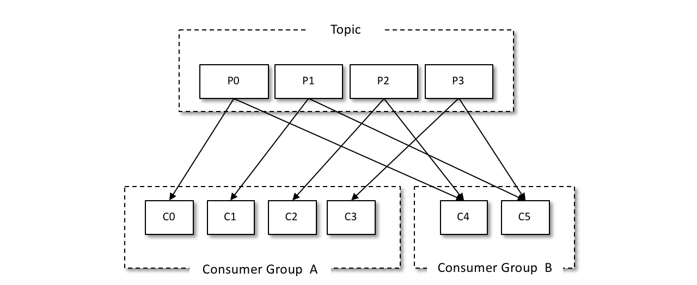
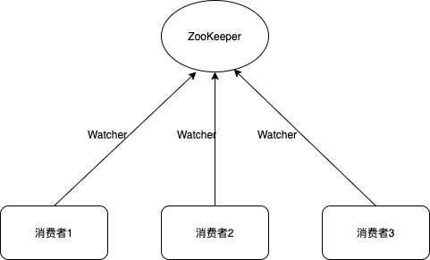
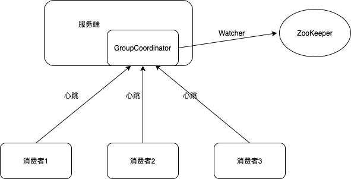

# 1. 前言

在Kafka中，消息被发到特定的主题，而一个主题又可以配置为多个分区，因此发往这个主题的消息就会被分配到多个分区上了。

而在一个消费组中，当有多个消费者订阅了这个主题，主题的这些分区就会分别被分配给这些消费者，每个消费者只能拉取被分配到的分区的消息。通过水平扩展多个消费者，可以极大地提升消息的消费效率。

如下图所示，主题分成4个分区P0、P1、P2、P3，有两个消费组A和B，它们分别给自己的消费组分配对应的分区，不同的消费者分别对应负责不同的分区。



看起来一切都很稳定，消费组里每个消费者各司其职，都有它们负责的分区。可是实际上分区的分配往往会发生变化，主题的分区数增加，以及消费者数量增加减少，都会对现有的分区分配造成影响。这时候，就需要重新给消费组的消费者们重新分配分区，这个过程就叫做Rebalance（分区再均衡）。


# 2. Rebalance触发条件

既然Rebalance是把分区分配给消费者这个过程的再均衡，因此触发Rebalance的条件也就是分区数量变化和消费者数量变化。实际上有以下几种情况：

- 消费组订阅的主题出现分区数量的变化，由于主题分区数不能减少，所以这里的变化也就指的是增加
- 新的消费者加入消费组
- 有消费者宕机下线，或遇到长时间的GC或网络延迟等，导致消费者长时间未向GroupCoordinator发送心跳
- 有消费者主动退出消费组
- 消费者取消对某主题的订阅


# 3. Rebalance的三种方案

Kafka历史上有过三个版本的Rebalance方案，一步步改进变化成为方案三，也就是现在的方案。

## 3.1 方案一

Kafka最早的解决方案是通过ZooKeeper的Watcher实现的。

每个消费组在ZooKeeper下维护了路径/consumers/[group_id]/ids，消费组的每个消费者在创建的时候，在这个ZooKeeper路径下用临时节点记录自己的消费者id属于此消费组。每个消费者分别在/consumers/[group_id]/ids和/brokers/ids路径上注册一个watcher，以分别监听消费组的消费者变化和broker增减。



每个消费者通过watcher监控消费组和Kafka集群的状态，这种方案严重依赖于ZooKeeper，会有两个比较严重的问题：

- 羊群效应：一个被watch的ZooKeeper节点变化，会导致大量的watcher通知被发送给客户端，从而导致在通知期间的其他操作延迟。
- 脑裂：每个消费者通过ZooKeeper来保存元数据和Rebalance结果，不同消费者在同一时刻可能连接到ZooKeeper集群的不同服务器，看到的数据就可能不一样。

## 3.2 方案二

将全部消费组分成多个子集，每个消费者子集在服务端对应一个GroupCoordinator进行管理。

消费者不再依赖ZooKeeper，而只有GroupCoordinator会在ZooKeeper上添加watcher。消费者在加入或退出消费组时会修改ZooKeeper的元数据，触发GroupCoordinator的watcher，GroupCoordinator就开始Rebalance操作。



## 3.3 方案三

Kafka 0.9版本进行了重新设计，将分区分配的工作放到了消费者端，而消费组的管理工作依然由GroupCoordinator处理。


# 4. Rebalance实现

Rebalance分为消费者和服务端两块，消费者主要是负责分区分配和向服务端的GroupCoordinator发送请求，而服务端的GroupCoordinator则负责为每个消费组维护一个状态机。

## 4.1 消费者

#### 第一阶段

每个消费者会有一个消费者协调器ConsumerCoordinator，而每个broker会启动一个组协调器GroupCoordinator。

Rebalance操作的第一步是查找GroupCoordinator，消费者会向Kafka集群中的任意一个broker发送GroupCoordinatorRequest请求，并处理返回的响应。

```java

```


#### 第二阶段

#### 第三阶段

## 4.2 服务端


# 参考

- [《Apache Kafka源码剖析》](https://book.douban.com/subject/27038473/)

