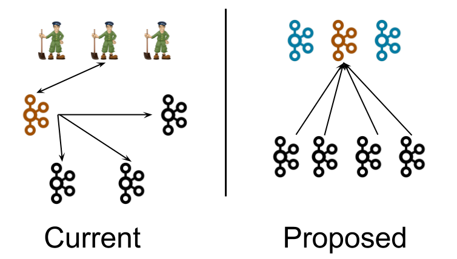
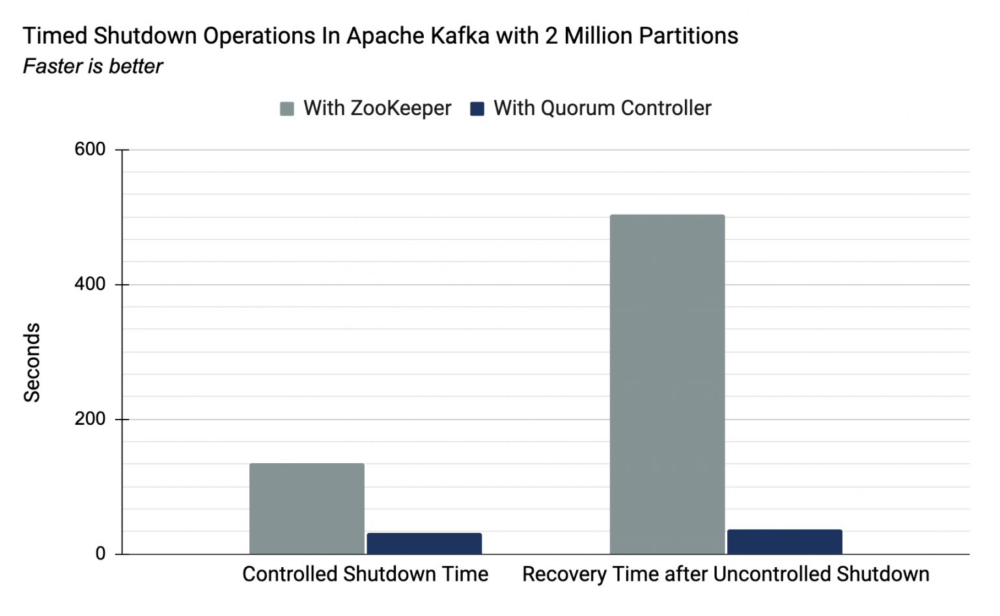

# 1. 概述

Kafka自2.8开始，移除了之前用于集群的元数据管理、控制器选举等的ZooKeeper的依赖，转而使用Kraft代替，本文来聊聊这一改动的差异和影响。

使用过Kafka都知道，在安装Kafka之前，需要先安装Java和ZooKeeper。需要Java是因为ZooKeeper和Kafka都是用Java编写的，运行需要Java环境。而需要ZooKeeper则是因为，Kafka是使用ZooKeeper来保存集群的元数据信息和消费者信息，进行控制器选举的，因此Kafka的运行需要ZooKeeper的支持。

而在Kafka 2.8中，将移除对ZooKeeper的依赖，转而使用基于KRaft的Quorum控制器。

但是目前据官方声称有些功能还不是太完善，建议先不要用于生产环境。


# 2. 依赖ZooKeeper的Kafka

Kafka体系架构包含若干Producer、若干Broker、若干Consumer，以及一个ZooKeeper集群。Kafka通过ZooKeeper管理集群broker和消费者的元数据，以及用于进行控制器选举。


# 3. Kafka在ZooKeeper中的数据

## 3.1 选举控制器

Kafka通过ZooKeeper的临时节点实现选举控制器的功能。

Broker集群中，第一个启动的broker会在ZooKeeper中创建临时节点/controller，从而成为控制器。其他broker启动后也会尝试创建该临时节点，但是会收到节点已存在的异常，从而获知控制器节点已存在，并注册一个监听器。

在控制器关闭或断开连接后，临时节点/controller被删除，其他broker通过监听得到通知并再次尝试创建临时节点/controller，第一个创建成功的broker成为新的控制器，其他获得异常并再次进行监听。

## 3.2 Broker注册

Kafka的Broker是分布式部署并且相互间独立运行的，但是需要在ZooKeeper进行注册，以将整个集群的Broker服务器管理起来。

ZooKeeper中专门使用Broker节点进行Broker服务器列表的记录，节点路径为/brokers/ids。

每个Broker服务器在启动时，都会到ZooKeeper上进行注册，根据各自的Broker ID创建属于自己的节点，节点路径为/brokers/ids/[0...N]，并且将自己的IP地址和端口等信息写入该节点。

这个节点是一个临时节点，在Broker服务器宕机或是下线后，对应的节点就被删除了。

## 3.3 Topic注册

在Kafka中，一个Topic的消息会分成多个分区并分布到多个Broker上，这些分区信息以及与Broker的对应关系也都是ZooKeeper维护的，使用专门的Topic节点来记录，节点路径为/brokers/topics。

每一个Kafka的Topic都记录在/brokers/topics/[topic]节点中。

Broker服务器在启动后，会到对应的Topic节点下注册自己的Broker ID，并写入针对该Topic的提供消息存储的分区总数。如节点路径/brokers/topics/[topic]/[broker_id]的节点内容为2，表明该broker在该topic中提供了2个分区的消息存储。

这个节点也是一个临时节点，在Broker服务器宕机或是下线后，对应的节点就被删除了。

## 3.4 消费者注册

每个消费者在启动的时候，都会在ZooKeeper创建一个属于自己的消费者节点，且为临时节点，这样消费者出现故障或是下线后，对应的消费者节点就会被删除掉。

节点路径为/consumers/[group_id]/ids/[consumer_id]，节点内容为消费者订阅的Topic信息。

每个消费者都会对所属消费者分组的/consumers/[group_id]/ids节点进行Watcher监听，以在消费者新增或减少时，触发消费者负载均衡。同时对/brokers/ids/[0...N]的节点注册监听，在broker服务器列表发生变化时，根据情况决定是否需要消费者的负载均衡。

## 3.5 消息分区与消费者关系

对于每个消费者分组，Kafka都会为其分配一个全局唯一的Group ID，同时Kafka也会为每个消费者分配一个Consumer ID，通常为Hostname:UUID的形式。

Kafka的设计规定了每个消息分区有且只有一个消费者进行消息消费，因此需要在ZooKeeper记录消息分区与消费者之间的对应关系。节点路径/consumers/[group_id]/owners/[topic]/[broker_id-partition_id]，节点内容为Consumer ID，记录了一个消费者分组对于各个主题的分区所分配的消费者id。

## 3.6 消息消费进度Offset记录

ZooKeeper同时还记录了消费者对指定消息分区进行消息消费的过程中，定时提交的消费进度，即Offset。这有助于在该消费者重启，或其他消费者接管该消息分区的消息消费后，能够从之前的进度开始继续消息的消费。

节点路径为/consumers/[group_id]/offsets/[topic]/[broker_id-partition_id]，节点内容就是Offset值。


# 4. 为什么要去掉ZooKeeper

1. 在之前的版本中，Kafka依赖于ZooKeeper，需要管理部署两个不同的系统，让运维复杂度翻倍，还让Kafka变得沉重，进而限制了Kafka在轻量环境下的应用。去掉ZooKeeper使得Kafka的部署更简单，更轻量级。
2. ZooKeeper的分区特性限制Kafka的承载能力。在分区数量多的时候，控制器节点重新选举、分区首领切换需要进行很多的ZooKeeper操作，ZooKeeper存储的元数据数据量也更多，可能导致监听的延时增长或丢失，故障恢复耗时也更长。
3. Raft协议比ZooKeeper的ZAB协议更易懂，更高效，能提高控制器选举的速度和分区首领选举的速度。


# 5. 去掉ZooKeeper的Kafka

## 5.1 体系架构对比



左图所示为目前的结构，有着3个ZooKeeper节点和4个Kafka broker节点，其中橙色的为broker节点中的控制器，控制器会向其他broker节点推送消息。

右图所示为去掉ZooKeeper后的结构，用控制器节点代替了ZooKeeper节点，还有普通的broker节点。控制器节点为元数据分区选举出一个橙色的leader，也称为活动控制器（active controller），其他控制器节点为follower节点。普通节点从leader拉取元数据。控制器进程与broker进程逻辑上分开，但是物理上不必分开，可以部署在同样的节点上。

元数据的更新也从通过向ZooKeeper注册监听的方式修改为普通节点主动从活动控制器拉取的方式。

## 5.2 quorum控制器

新的架构使用quorum控制器来事件来管理元数据日志，元数据日志包含集群元数据的每次更改，之前存在ZooKeeper的主题、分区、配置等信息都存在这个日志中。控制器节点中leader节点（上方右图的橙色节点）处理所有broker节点的请求，而其他follower节点（上方右图的蓝色节点节点）则复制数据，以在leader节点故障时转移状态为leader。Raft需要超过半数节点运行才能继续运行，所以三个节点的控制器允许一个节点故障，五个节点的控制器允许两个节点的故障。

元数据的更新也从通过向ZooKeeper注册监听的方式修改为普通节点主动从活动控制器拉取的方式。


## 5.2 启动方式

1. 为Kafka集群生成一个集群ID

   ```bash
   $ ./bin/kafka-storage.sh random-uuid
   xtzWWN4bTjitpL3kfd9s5g
   ```

2. 用生成的ID格式化存储目录，对于单节点在该节点运行，对多节点则在每一个节点运行

   ```bash
   $ ./bin/kafka-storage.sh format -t <uuid> -c ./config/kraft/server.properties
   Formatting /tmp/kraft-combined-logs
   ```

3. 在每个节点上启动Kafka，然后Kafka就启动起来了，过程中没有用到ZooKeeper

   ```bash
   $ ./bin/kafka-server-start.sh ./config/kraft/server.properties
   ```


## 5.3 配置

1. 每个Kafka broker需要在配置文件中配置一个process.roles，他的值可能是如下几个：

   - broker，该节点设置为KRaft模式的一个普通节点
   - controller，该节点设置为KRaft模式的控制器节点
   - broker,controller，该节点设置为KRaft模式的既是控制器节点也是普通节点，上面说了，控制器节点和普通节点在逻辑上不同，但是是可以部署在同一个节点上的
   - 未设置，该节点设置为ZooKeeper模式

2. 每个控制器节点需要配置节点id，即node.id，例如集群中配置3个控制器节点，节点id可以设置为0,1,2

   ```
   node.id=0
   ```

3. 每个控制器节点和普通节点必须配置监听地址

   ```
   # 普通节点
   listeners=PLAINTEXT://localhost:9092
   # 控制器节点
   listeners=PLAINTEXT://:9093
   # 普通节点&控制器节点
   listeners=PLAINTEXT://:9092,CONTROLLER://:9093
   ```

4. 每个控制器节点和普通节点必须配置Quorum Voters，也就是controller.quorum.voters

   ```
   controller.quorum.voters=id1@host1:port1,id2@host2:port2,id3@host3:port3
   ```

5. 元数据日志查看的两种方式

   ```bash
   # kafka-dump-log
   $ ./bin/kafka-dump-log.sh  --cluster-metadata-decoder --skip-record-metadata --files /tmp/kraft-combined-logs/\@metadata-0/*.log
   
   # Metadata Shell
   $ ./bin/kafka-metadata-shell.sh  --snapshot /tmp/kraft-combined-logs/\@metadata-0/00000000000000000000.log
   >> ls /
   brokers  local  metadataQuorum  topicIds  topics
   >> ls /topics
   foo
   >> cat /topics/foo/0/data
   {
     "partitionId" : 0,
     "topicId" : "5zoAlv-xEh9xRANKXt1Lbg",
     "replicas" : [ 1 ],
     "isr" : [ 1 ],
     "removingReplicas" : null,
     "addingReplicas" : null,
     "leader" : 1,
     "leaderEpoch" : 0,
     "partitionEpoch" : 0
   }
   >> exit
   ```

## 5.4 Raft算法

以下动画网页很好地展示了Raft算法的原理和同步、复制、领导选举等步骤：

http://thesecretlivesofdata.com/raft/

## 5.5 性能对比

quorum控制器的引入极大降低了多分区情形下关闭与重启的耗时，从而提高了分区的数量上限。

以下为Kafka在新旧的架构中拥有200万分区时关闭和启动恢复的速度，可以看出在新的架构下时间是大大缩短的。




# 6. 参考

- [《从Paxos到Zookeeper》](https://book.douban.com/subject/26292004/)
- [《Kafka权威指南》](https://book.douban.com/subject/27665114/)
- [KIP-500: Replace ZooKeeper with a Self-Managed Metadata Quorum](https://cwiki.apache.org/confluence/display/KAFKA/KIP-500%3A+Replace+ZooKeeper+with+a+Self-Managed+Metadata+Quorum)
- [kafka/README.md at trunk · apache/kafka](https://github.com/apache/kafka/blob/trunk/config/kraft/README.md)
- [帅呆了！Kafka移除了Zookeeper！](https://blog.csdn.net/lycyingO/article/details/116246371)
- [深度解读：Kafka 放弃 ZooKeeper，消息系统兴起二次革命](https://www.infoq.cn/article/PHF3gFjUTDhWmctg6kXe)
- [Kafka Without ZooKeeper: A Sneak Peek At the Simplest Kafka Yet](https://www.confluent.io/blog/kafka-without-zookeeper-a-sneak-peek/)
- [http://thesecretlivesofdata.com/raft/](http://thesecretlivesofdata.com/raft/)

