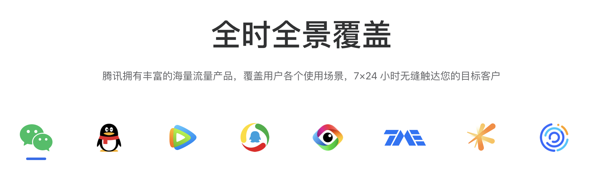
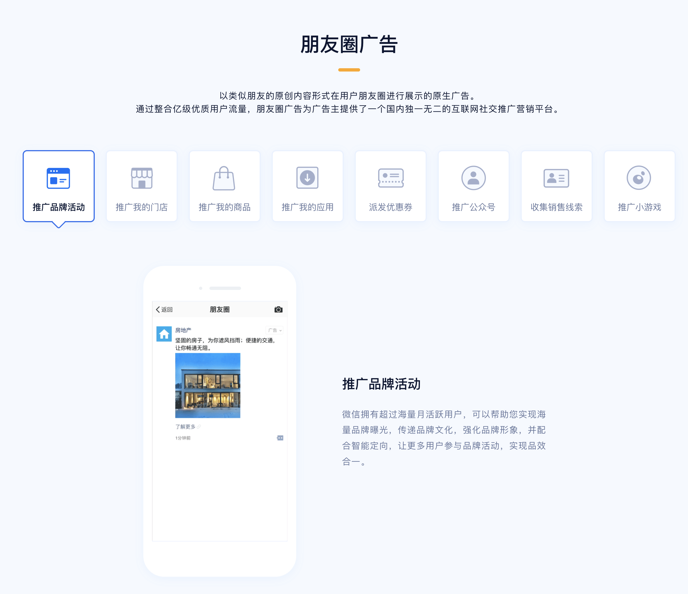
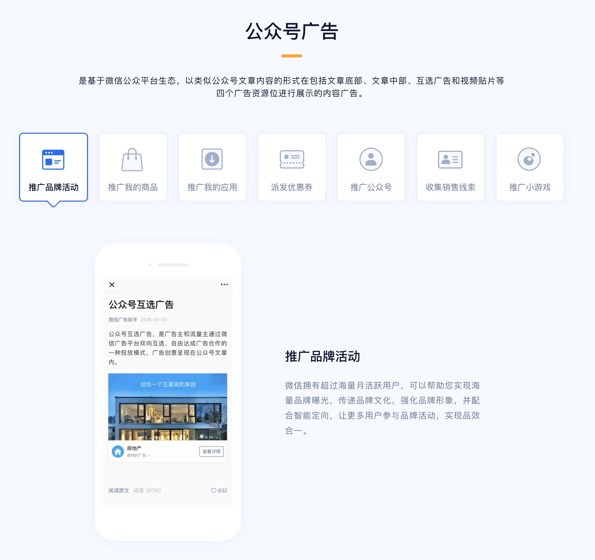
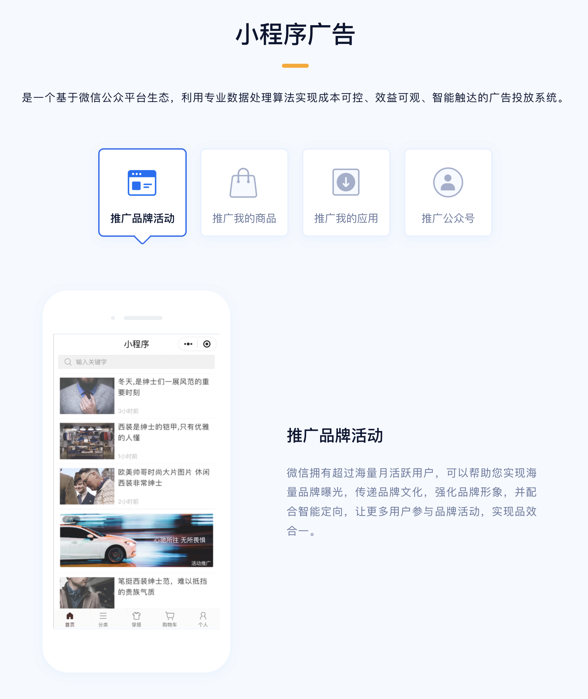
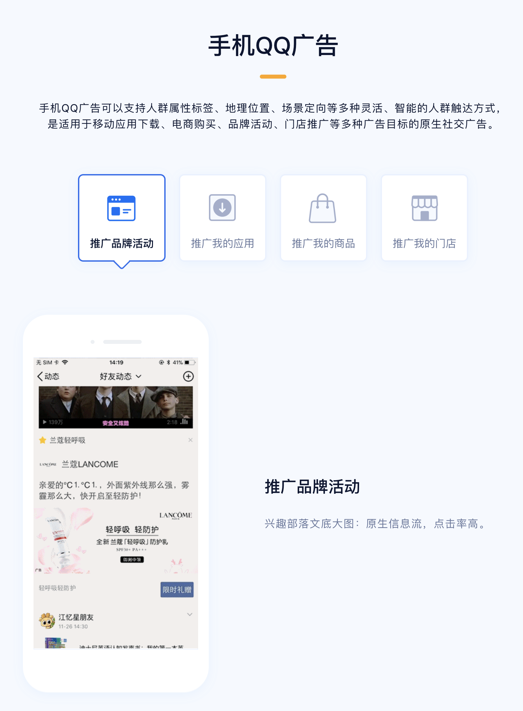
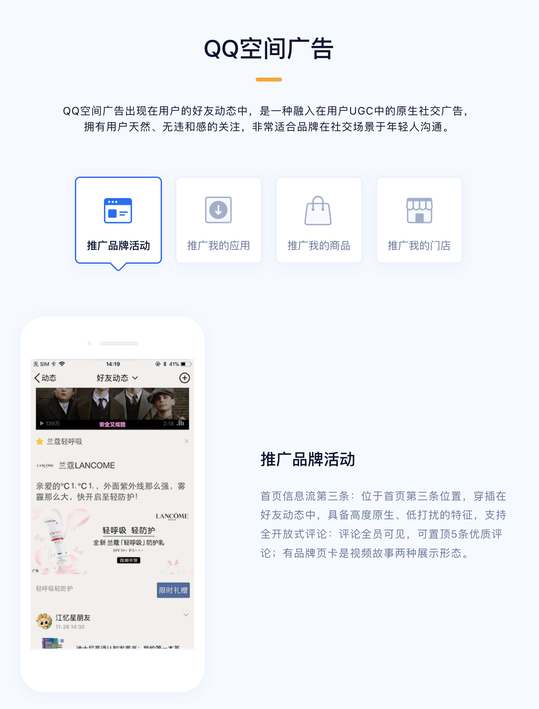
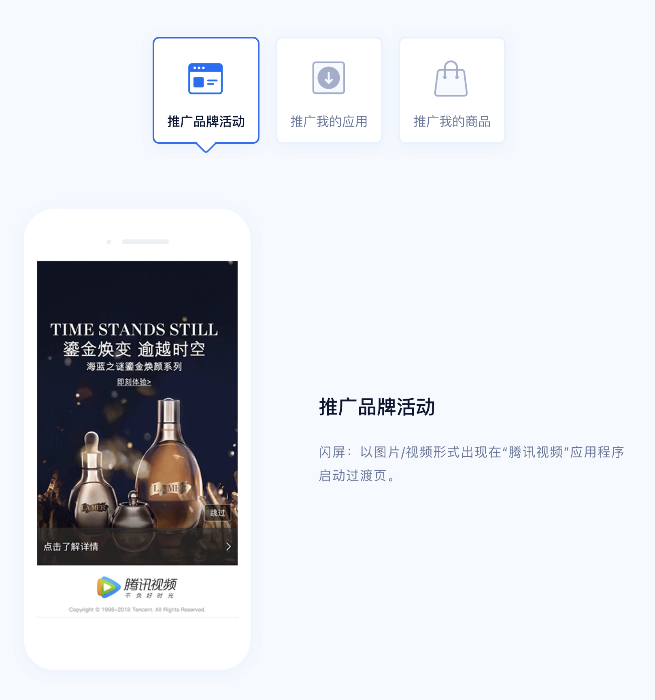
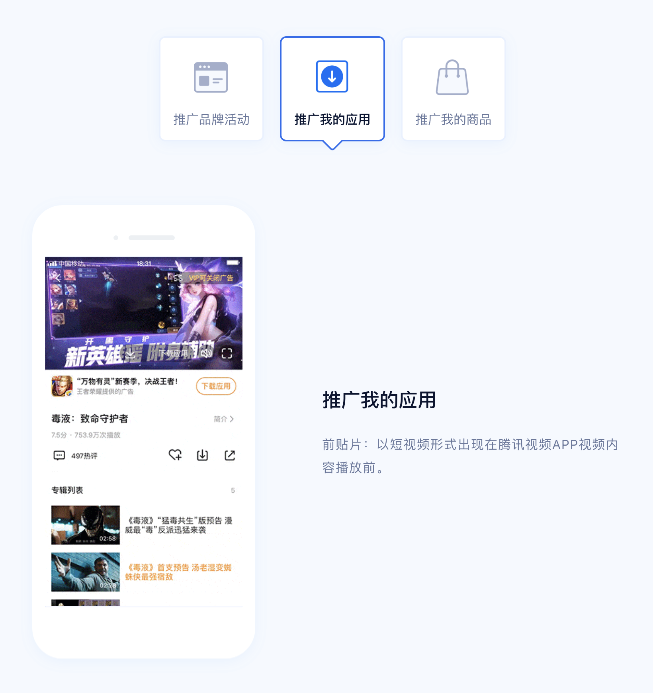
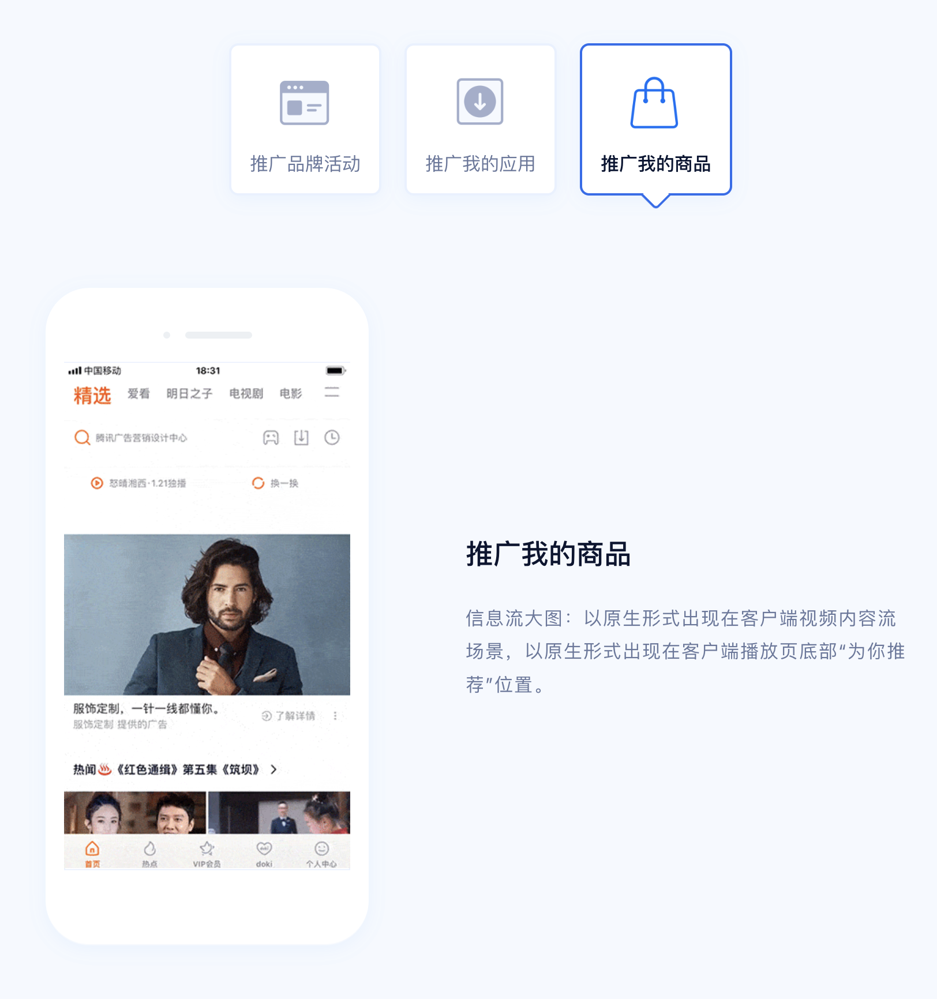

> 由于工作上负责对接腾讯广告，通过接入腾讯广告来管理广告投放和效果数据的收集、展示，因此对腾讯广告整理了这篇文章，简要介绍腾讯广告是什么，它有什么能力，我们又该如何使用它。

# 1. 腾讯广告简介

腾讯广告，原称广点通，由于它属于腾讯的广告营销服务线(AMS)有时我们也称它为AMS。腾讯广告是腾讯推出的广告平台，为广告主提供在腾讯自家的应用（如微信、腾讯视频等）的广告位中投放广告的能力，同样身为广告平台的还有字节跳动的巨量引擎（在今日头条、抖音等应用投放广告）、百度、快手等，都是依托于自家的应用流量，以提供广告投放。

## 1.1 投放应用

腾讯广告支持投放广告的应用主要有以上：微信、QQ、腾讯视频、腾讯新闻、腾讯看点、腾讯音乐、腾讯游戏、优量汇。每个应用又提供了不同的广告形式和广告版为，供广告主选择最合适的，进行广告投放。

### 1.1.1 微信

在微信上可以投放的广告有朋友圈广告、公众号广告、小程序广告这三种。我们平时在使用微信的时候，经常可以看到这三种形式的广告。

### 1.1.2 QQ

QQ上有手机QQ广告、QQ空间广告这两种形式。

### 1.1.3 腾讯视频

腾讯视频有闪屏、前贴片、信息流大图等版位可供广告投放展示选择。

### 1.1.4 常见广告版位

腾讯看点、优量广告、腾讯音乐支持的版位和腾讯视频较为相似，不再一一赘述。总结常见的广告版位有这么几种：

1. 闪屏：在刚打开APP时弹出的开屏广告，用户点击可以跳转到广告页面，或者几秒钟后进入应用。
2. 前贴片：以短视频的形式嵌入到播放的视频的前面几秒。
3. 信息流：在信息流APP中，将广告以原生形式混入信息流内容中，成为其中一个内容，一半还会有个"广告"等字样区别于其他普通的信息流。
4. 横幅：广告固定展示在APP页面的最上面或最下面一条内容。
5. 激励视频：播放一段视频，一定时间之后才可关闭，有时候看完激励视频可以获得游戏道具等奖励。
6. 视频暂停大图：播放视频暂停时，就会在画面中间弹出广告，恢复播放后又消失了。
7. 内容页：在文章底部融入广告内容展示。

具体的各个应用以及支持的广告形式和广告版位可以在帮助文档中详细查看：

https://e.qq.com/ads/helpcenter/detail?cid=2228&pid=4655

## 1.2 广告投放

# 2. 控制台

# 3. 开发文档

腾讯广告可以通过API和SDK的方式访问，进行广告创建和投放、资产管理、效果数据的获取等。

开发文档地址：

https://developers.e.qq.com/docs/start

接口清单：

https://developers.e.qq.com/docs/api/apilist

最新动态，最好定时地关注这一块的更新内容，对于新接口的增加或旧接口的下线都需要提前做出适配处理：

https://developers.e.qq.com/news

## 3.1 入门

## 3.2 广告管理

# 参考

- [腾讯广告](https://e.qq.com/ads/)
- [腾讯广告帮助中心](https://e.qq.com/ads/helpcenter/)
- [腾讯广告开发文档](https://developers.e.qq.com/docs/start)

