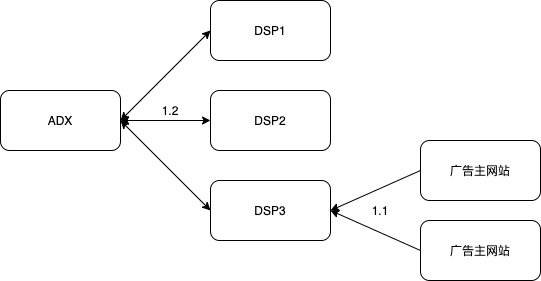
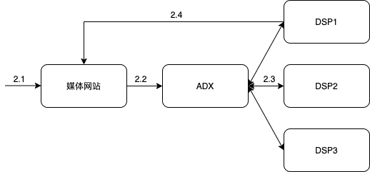
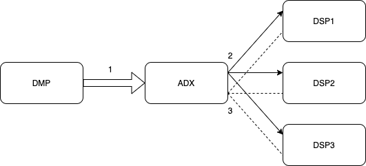

# 1. 在线广告基础

## 1.1 在线广告综述

互联网软件产品往往以免费的形式服务用户，这称为免费模式，免费产品在传播信息的流程中，获得了三项可变现的核心资产：

1. 流量。有人在使用产品时，可以在产品本身的功能之外夹带一些付费内容，也就是广告。
2. 数据。在使用产品的过程留下的行为和属性，如浏览过的商品、填写的资料都是数据，基于这些信息可以调整付费投放内容的策略，提高效率。
3. 影响力。产品和内容获得了更高的关注和信任，因此投放的付费内容也获得了更好的关注效果，在投放广告时可以获得品牌溢价。

### 广告的定义

广告是由已确定的出资人通过各种媒介进行的有关产品（商品、服务和观点）的，通常是有偿的、有组织的、综合的、劝服性的非人员的信息传播活动。

广告活动中有两个主动的参与方：需求方（demand）和供给方（supply）。需求方可以是广告主（advertiser）、代表广告主利益的代理商（agency）或其他技术形态的采买方，供给方可以是媒体或其他变现平台。广告还有一个被动的参与方，即受众（audience）。

### 广告的目的

在传统媒体时代，传统广告的目的是借助媒体力量来快速接触大量用户，宣传品牌形象，提升中长期购买率与利润空间，这种目的的广告称为品牌广告（brand awareness）。很多广告商希望利用广告手段马上带来大量的购买或其他转化行为，这种广告称为效果广告（direct response）。传统媒体缺乏投送和优化效果广告的能力，数字媒体的出现使效果广告发展起来，使得投送个性化广告更低成本，并且在线服务也能更清楚了解用户的意图。

### 在线广告表现形式

1. 横幅广告（banner ad）。嵌入页面中的固定大小版面，一般是图片或Flash或HTML5。
2. 文字链广告（textual ad）。搜索广告的主流形式，有时像横幅广告那样占据固定版面，有时穿插在大量内容链接条目中。
3. 富媒体广告（rich media ad）。常见形式有弹窗、全屏等。
4. 视频广告（video ad）。主要形式有视频内容播放前插入广告、信息流中的视频广告、手机游戏的激励视频广告。
5. 交互式广告（playable ad）。用户可以在创意上完成交互的广告。
6. 社交广告（social ad）。在社交网络的信息流中插入广告。
7. 移动广告（mobile ad）。app的开屏广告、横屏广告、积分墙、推荐墙等。
8. 邮件营销广告（Email Direct Marketing，EDM）。通过电子邮件推广信息，容易被当成垃圾软件。
9. 激励广告（incentive ad）。激励用户完成任务，以产生转化，能显著提高转化效率，但用户没有真实需求，后续效果不好。
10. 团购。广告主是本地化的店铺，为了获得新客。
11. 游戏联运。用户在游戏内消费在推广渠道和开发商之间进行分成。
12. 固定位导航。导航网站的固定展示位，一半按时间付费。

## 1.2 计算广告基础

### 广告效果产生过程

广告从用户接触开始，到产生最终效果，分为以下六个阶段：

1. 曝光。指广告展现出来的过程。
2. 关注。指用户意识到广告，曝光不一定意味着关注。
3. 理解。受众理解了广告传达的信息。
4. 接受。受众认可广告信息。
5. 保持。广告传达的信息给用户留下记忆，长时间影响选择。
6. 决策。广告产生用户的转化行为。

### 互联网广告的技术特点

1. 技术和计算导向。在线广告可以进行惊喜的受众定向，有精确的预估和优化能力。
2. 效果的可衡量性。可以记录和优化广告效果。
3. 创意和投放方式的标准化。
4. 媒体概念的多样化。
5. 数据驱动的投放决策。

### 计算广告的核心问题

计算广告的核心问题，是为一系列用户与上下文的组合找到最合适的广告投放策略，以优化整体广告活动的利润。

在每次广告展示中，有着对应的收入r和成本q，r-q即为这次展示产生的利润。计算广告优化的目标，就是为了让所有的展示对应产生的利润之和最优化，达到最大。

## 1.3 计算广告常用指标

### 收入指标

eCPM：千次展示期望收入（expected cost per mille），是点击率和点击价值的乘积，是计算广告和心得量化指标之一。

### 广告转化

点击率（click through rate，CTR）：点击量/展示量，广告展示后点击的比率。

到达率：打开落地页（landing page）量/点击量，点击广告后成功打开落地页的比率。

转化（conversion）：用户完成相应操作，如电商网站完成下单，app产生安装或注册，游戏产生付费等。

转化率（conversion rate，CVR）：转化次数/到达次数，从落地页完成转化的比率。

### 结算方式

CPT结算（cost per time）：将广告位以独占的方式交给某个广告主，按独占的时间段收取费用。适用于高曝光的品牌广告，但无法定向受众。

CPM结算（cost per mille）：按照千次展示结算。适用于定向受众的品牌广告和实时竞价广告。

CPC结算（cost per click）：按点击结算。点击率估计由供给方完成，点击价值估计由需求方完成，并通过出价的方式向市场通知自己的估价。适用于实时竞价广告。

CPA结算（cost per action）：按转化行为结算，又叫CPS（cost per sale）、ROI结算。适用于效果类DSP。

oCPM结算（optimized CPM）：广告平台按照CPM结算收费，但会根据转化率进行优化。供给方承担点击率和点击价值估计的任务。

### 统计指标

ROI

LTV

# 2. 在线广告产品

## 2.1 在线广告产品概述

### 广告的发展阶段

在线广告产品的发展分为四个阶段：

1. 合约广告产品。由线下广告的交易形式衍生而来，分为按时段售卖的CPT广告和按约定展示量售卖CPM广告。
2. 竞价广告产品。主要形式是搜索广告，对搜索关键词竞价。
3. 程序化交易广告。交易形式为实时竞价。
4. 原生广告产品。让广告以原生的方式和其他内容混合。

每种广告产品基本有3个组成部分，即面向需求方的接口、面向供给方的接口以及中间的投放系统及匹配策略，接口一般以API或SDK的方式对外提供。

### 广告的层级组织

大多数需求方提供的广告是分层次管理的，广告层次一半依次为广告主（advertiser）、广告计划（campaign）、广告组（adgroup）、广告创意（creative），对于广点通、百度、巨量引擎等来说名称和层级会略有差异，但大体都差不多。

分成这几层，是为了在每一层管理广告投放中的不同信息。广告主层级用于管理一个广告主的通用信息，投放信息则由下面三个层级管理。广告计划概念上对应于广告主的一次投放，包括预算、时间范围等。广告组对应一个具体的广告投放策略，如广告受众定向、出价。广告创意对应最终展示出来受众看到的素材，包括文字/图片/视频的内容、落地页地址、监测地址。

### 供给方管理接口

供给方（媒体）对业务控制相对要简单，主要分为媒体和广告位两个层次，媒体可以是网站或者移动应用。

## 2.2 合约广告

在在线广告业务的初始阶段，线下广告的商业逻辑被照搬到线上，由广告代理公司和媒体签订协议，确保某些广告位在某些时间段为指定的广告商所占有，广告商按整体合同支付广告费用。合约广告的重要形式是按照CPM计费的展示量合约，并且催生了受众定向技术。

广告位合约是最早的在线广告售卖方式，媒体和广告主约定某一时间段内某些广告位固定投送该广告主的广告，相应的结算方式为CPT结算。这种方式无法做到按受众投放广告，也无法进行深入的效果优化，适用于品牌广告而非效果广告。

展示量合约则是约定某种受众条件下的展示量，按照约定的单位展示量价格来结算，也叫担保式投送（guaranteed delivery，GD）。

### 受众定向

受众定向技术对于合约广告和各种竞价广告非常重要。通过建立一个标签体系，将每个用户映射到其中一个或几个标签上。

常用的定向有：

1. 地域定向
2. 人口属性定向：包括年龄、性别、受教育程度、收入水平等。
3. 上下文定向：根据网页或应用的具体内容来匹配相关的广告。
4. 行为定向：根据用户历史访问行为了解用户兴趣，投送相关广告。
5. 精确位置定向
6. 重定向：对某个广告主过去一段时间的访客投放广告。
7. 新客推荐定向
8. 动态定价
9. 场景定向：基于移动设备的使用场景投放广告。

## 2.3 搜索广告与竞价广告

### 搜索广告

搜索广告是典型的竞价广告产品，其特点是广告主就某标的物（关键词）的广告展示机会展开拍卖式的竞争，并根据竞争结果一次占据广告展示的若干位置。

PC搜索广告的位置一般分为北、东、南三个部分，位置上北区优于东区，最差的是南区，位置更优也意味着竞价排序更靠前。

搜索广告最基本的形式是与自然检索结果一致的文字链，并在底色和角上加上“推广”、“Ads”的字样，和自然结果区别开来。搜索广告竞价的标的物是竞价关键词（bid term），用户输入的查询与关键词相匹配，来确定是否出发广告。匹配可以简单地精确匹配，也可以进行查询扩展。

搜索广告有鲜明的特点，首先是变现能力即eCPM远高于一般的展示广告，而且搜索广告根据搜索关键词选择广告，可以进行非常精准的定向，搜索广告与其他自然结果相关性接近也有利于提高广告效果。

搜索广告产品还可以提供结构化的广告内容摘要，和一些直接访问的内容，减少用户跳转的成本，有利于提高推广效率。如在搜索旅游相关时直接展示订机票和酒店的快捷入口。

### 位置拍卖与定价

竞价广告市场往往会设置一个赢得拍卖位置的最低价格，称为市场保留价（market reserve price，MRP），也叫起价或低价。

位置拍卖需要研究如何定价，研究市场处于稳定状态下的收益和其他特性，稳定是指整个竞价系统处于纳什均衡状态（nash equilibrium），即每个广告商都通过出价得到了最符合自己利益的位置。

**广义第二高价（GSP）**

第二高价（second price）指在一个位置的拍卖中，向赢得该位置的广告商收取下一位广告主的出价，这也叫做Vickrey拍卖。对每个位置赢得位置的广告主都按下一位广告主出家来收取费用，就是广义第二高价。这种方式是社会福利最优，而不是广告平台收入最优。

这种出价方式可以让广告主忠实地按照自己的回报价值来出价，而且方式简单，是实际的竞价广告系统中最主流的定价策略。

如果按照用户实际出价而不是二价来收取费用，广告商就会不断调整出价，并观察排序结果，得到刚好比下一位多一点的出价价格。这对于竞价系统需要不断地调整模型，会对竞价系统造成压力，而使用二价可以杜绝这种情况发生。

**VCG**

对赢得某个位置的广告主，其付出的成本应该等于他占据这个位置给其他市场参与者带来的价值损害。这种定价向广告主收取的费用最少，是社会福利最优的定价方式，但平台收入不如GSP，定价逻辑也比较复杂。

**Myerson最优拍卖**

广告平台更加关注的是使平台的收入最高，也称为最优拍卖问题。但这种机制不保证按照出价高低排序，影响定价结果和排序结果，因此很少采用。

**竞价广告网络**

未通过合约售卖的广告流量很多，称为剩余流量（remnant inventory），广告网络产品就是批量聚合各媒体的剩余流量，按照人群或上下文标签切割售卖给广告主。

## 2.4 程序化交易广告

广告交易平台（ad exchange，ADX），通过RTB的方式实时得到广告候选，并按竞价逻辑完成投放决策。其中采买方称为需求方平台（DSP），需要具备点击率预测、点击价值估计、流量预测、站外推荐等计算能力。还产生了供给方平台（SSP），用于优化媒体利益，决定通过各种变现手段最大化媒体收益。数据管理平台（DMP）和数据交易平台（data exchange）从第一方和第三方数据入手提供有价值的数据源和数据加工服务。

### 实时竞价流程

实时竞价分为两个过程，首先是预先将ADX与DSP的用户标识对应cookie映射过程。

1.1 从广告主网站向DSP服务器发起cookie映射请求。

1.2 DSP与ADX服务器之间通信完成cookie映射。

然后是线上广告请求时的竞价与投放过程。

2.1 用户接触到媒体网站的广告。

2.2 前端向ADX发起广告请求。

2.3 ADX向各DSP传送URL和用户标识，发起询价请求。各个DSP根据数据决定是否参与竞价，如果参与则计算并返回自己的出价。

2.4 在等待一个固定的时间片后，ADX选出出价最高的DSP返回给媒体网站。然后媒体网站从胜出的DSP拿到广告创意并展示给用户。

## 2.5 信息流与原生广告

移动广告的传统创意形式：

1. 横幅与插屏。横幅占据应用一定空间，插屏广告出现在游戏或其他应用暂停时，很容易误点击，对用户体验伤害较大。
2. 开屏与锁屏。应用打开或者设备锁定时展示的广告。
3. 推荐墙与积分墙。向用户推送应用下载类广告，并在激活后得到一定积分，点击和激活数据很好，但后续活跃程度低。

为了改善用户体验，让广告和正常内容和谐低共存，需要将移动广告原生化。

原生广告最重要的形式之一是信息流广告，存在于社交网络中，还有新闻类和短视频类的媒体上，将广告按照一定规则插入信息流的自然结果中。搜索广告也可以看成是存在于信息流当中的原生广告。软文广告的内容本身就是为了委婉地宣传某种产品。

## 2.6 数据加工与交易

数据管理平台（DMP）拥有数据资产，将其整理加工成可直接利用的信息，并支持变现。

对精准广告业务有贡献的数据种类：

1. 用户标识。浏览器使用的用户标识时cookie，iOS使用苹果设计的广告专用用户标识符（identifier for advertising，IDFA），Android采用Android ID或国际移动设备标识（international mobile equipment identity，IMEI）。
2. 用户行为。决策行为包括转化和预转化，主动行为包括广告点击、搜索和搜索点击，半主动行为包括网页浏览和分享，被动行为包括广告浏览。
3. 人口属性。与用户实名身份绑定得到，或者利用网络行为数据来预测人口属性标签。
4. 地理位置。根据IP映射城市，还可以根据GPS或蜂窝提供更精确的地址范围。
5. 社交关系。参考其社交网络朋友的行为和兴趣。
6. 设备信息。如设备型号、应用安装列表、年龄等。

### 数据交易过程

数据交易一般通过ADX或SSP作为中转来完成。

1. DMP将各种用户标签以批量传输的方式提供给ADX。
2. ADX发起询价请求。
3. 标签一般按CPM计价，如果DSP选择购买标签，则ADX将用户标签数据传给DSP，最终以DSP实际成交的展示量乘以CPM价格作为购买数据的附加费用。

# 参考

- [《计算广告 第2版》](https://book.douban.com/subject/34804492/)

